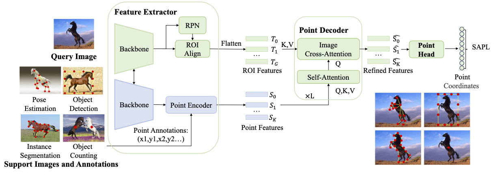

# UniFS

## Introduction

This repo contains the official PyTorch implementation of our ICCV paper
[UniFS: Universal Few-shot Instance Perception with Point Representations](https://arxiv.org/abs/2404.19401).

## Acknowledgement
This repo is developed based on [DCFS](https://github.com/gaobb/DCFS), [DeFRCN](https://github.com/er-muyue/DeFRCN) and [Detectron2](https://github.com/facebookresearch/detectron2). 

## License
UniFS is freely available for free non-commercial use, and may be redistributed under these conditions. For commercial queries, please contact Mr. Sheng Jin (jinsheng13[at]foxmail[dot]com). We will send the detail agreement to you.

