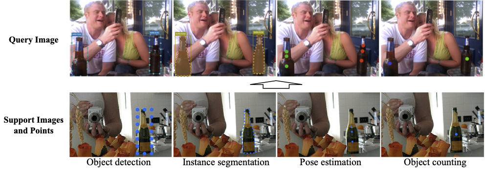
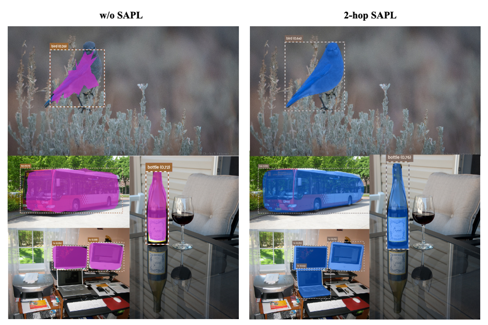

# UniFS

## Introduction

This repo contains the official PyTorch implementation of our ECCV'2024 paper
[UniFS: Universal Few-shot Instance Perception with Point Representations](https://arxiv.org/abs/2404.19401).

[](https://paperswithcode.com/sota/few-shot-object-detection-on-ms-coco-5-shot?p=unifs-universal-few-shot-instance-perception)
[](https://paperswithcode.com/sota/few-shot-object-detection-on-ms-coco-1-shot?p=unifs-universal-few-shot-instance-perception)

<div align="center"></div>

## Data Preparation
We evaluate our models on  [COCO-UniFS](https://drive.google.com/file/d/1H878NXuehoynWWfI6CloD0yNBKtbQzko/view?usp=sharing)
benchmark. This benchmark is built upon several existing datasets, including [MSCOCO](https://cocodataset.org/#download) and [MISC](https://github.com/YXSUNMADMAX/MISC210K).

The [COCO-UniFS](https://drive.google.com/file/d/1H878NXuehoynWWfI6CloD0yNBKtbQzko/view?usp=sharing) benchmark provides dense annotations for four fundamental few-shot computer vision tasks: object detection, 
instance segmentation, pose estimation, and object counting. The annotations for object detection and 
instance segmentation are directly taken from the MSCOCO dataset, which
provides bounding box and per-instance segmentation mask annotations for 80
object categories. For pose estimation, we extend the MSCOCO dataset by
adding instance-level keypoint annotations for 34 object categories from the
MISC dataset. The MISC dataset was originally designed for multi-instance
semantic correspondence, and we adapted it to fit the few-shot pose estimation
task.
The dataset split follows [DeFRCN](https://github.com/er-muyue/DeFRCN). 


  - Unzip the downloaded [COCO-UniFS](https://drive.google.com/file/d/1H878NXuehoynWWfI6CloD0yNBKtbQzko/view?usp=sharing) data-source to `datasets` and put it into your project directory:
    ```angular2html
      ...
      datasets
        | -- coco (trainval2014/*.jpg, val2014/*.jpg, annotations/*.json)
        | -- unifs_cocosplit
      unifS
      tools
      ...
    ```
## Training and Evaluation

* To reproduce the FSIS/gFSIS results on COCO
  ```angular2html
  bash run/run_unify.sh r101 dcfs 8
  
## Visualization Results 
The baseline DeFRCN may tend to incorrectly recognize positive object as background (middle two rows) due to the biased classification. This problem is greatly alleviated using our proposed method (DCFS).
<div align="center"></div>
<div align="center"></div>


## Acknowledgement
This repo is developed based on [DCFS](https://github.com/gaobb/DCFS), [DeFRCN](https://github.com/er-muyue/DeFRCN) and [Detectron2](https://github.com/facebookresearch/detectron2). 


## License
UniFS is freely available for free non-commercial use, and may be redistributed under these conditions. For commercial queries, please contact Mr. Sheng Jin (jinsheng13[at]foxmail[dot]com). We will send the detail agreement to you.

